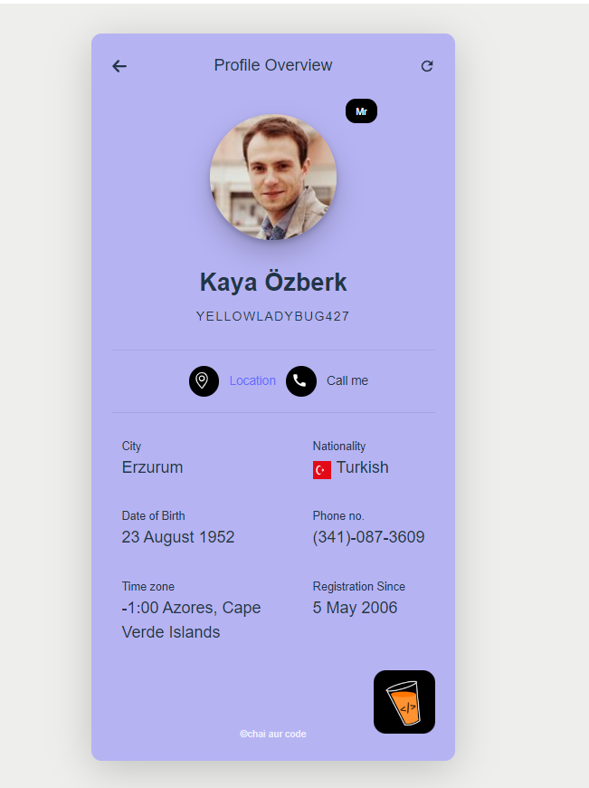
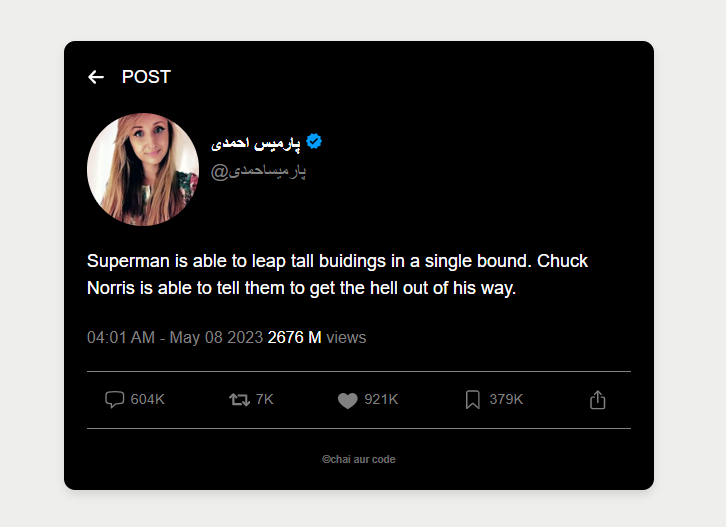
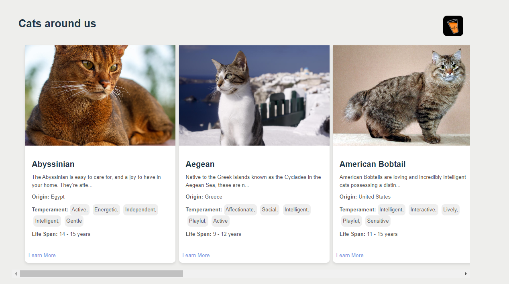

# React + Vite

# Clone Project in local using 'git clone <repository>' 
# run npm install 
# npm run dev 

# url to open pages

http://localhost:5173/random-user

http://localhost:5173/random-jokes

http://localhost:5173/cats-listing

